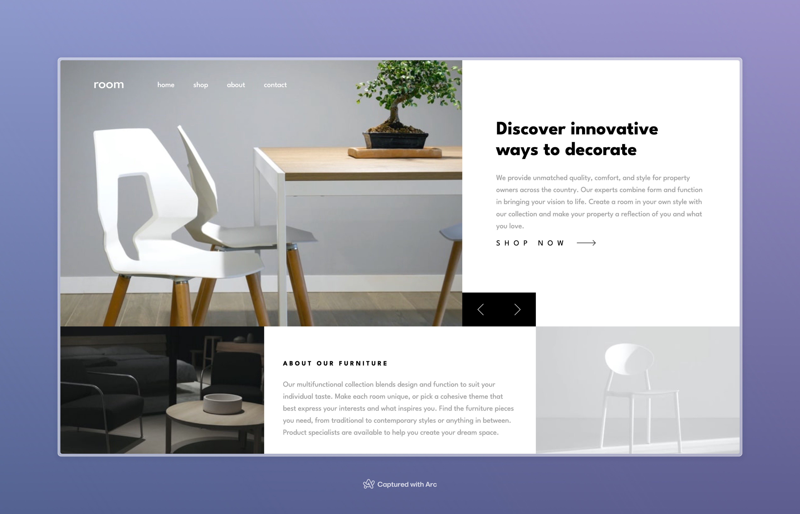

# Frontend Mentor - Room homepage solution

This is a solution to the [Room homepage challenge on Frontend Mentor](https://www.frontendmentor.io/challenges/room-homepage-BtdBY_ENq). Frontend Mentor challenges help you improve your coding skills by building realistic projects.

## Table of contents

- [Overview](#overview)
  - [The challenge](#the-challenge)
  - [Screenshot](#screenshot)
  - [Links](#links)
- [My process](#my-process)
  - [Built with](#built-with)
  - [Useful resources](#useful-resources)
- [Author](#author)

## Overview

### The challenge

Users should be able to:

- View the optimal layout for the site depending on their device's screen size
- See hover states for all interactive elements on the page
- Navigate the slider using either their mouse/trackpad or keyboard

### Screenshot

### Links

- Solution URL: [https://www.frontendmentor.io/solutions/responsive-room-homepage-built-with-html-css-and-js-bmqV4u2aX3](https://www.frontendmentor.io/solutions/responsive-room-homepage-built-with-html-css-and-js-bmqV4u2aX3)
- Live Site URL: [https://room-homepage-six-gamma.vercel.app/](https://room-homepage-six-gamma.vercel.app/)

## My process

### Built with

- Semantic HTML5 markup
- CSS custom properties
- Flexbox
- CSS Grid
- BEM
- Mobile-first workflow

### Continued development

Use this section to outline areas that you want to continue focusing on in future projects. These could be concepts you're still not completely comfortable with or techniques you found useful that you want to refine and perfect.

### Useful resources

- [An Interactive Guide to CSS Transitions](https://www.joshwcomeau.com/animation/css-transitions/) - This is an exceptional article by Josh Comeau that dives into the details of CSS transitions.
- [An Interactive Guide to Keyframe Animations](https://www.joshwcomeau.com/animation/keyframe-animations/) -

## Author

- Website - [samueladu.dev](https://www.samueladu.dev)
- Frontend Mentor - [@samuel-adu](https://www.frontendmentor.io/profile/samuel-adu)
- LinkedIn - [@theadusamuel](https://www.linkedin.com/in/thesamueladu/)
